# Vyomrix AI Security Intelligence Platform

The AI Security Intelligence Platform transforms Vyomrix from a reactive SIEM into an autonomous, proactive security analyst. It is completely decoupled from any single Large Language Model (LLM) and interacts through a specialized Prompt and Context Pipeline.

## 1. Architecture

```mermaid
graph TD
    A[SIEM Alert] -->|EventBus: AlertCreated| B(Context Builder)
    TI[Threat Intel] -->|Enrichment Data| B
    
    B -->|Structured Context| C{Prompt Builder}
    
    subgraph AI Agents
        SA[SOC Analyst]
        TA[Threat Intel Analyst]
        DE[Detection Engineer]
        IR[Incident Response Advisor]
    end
    
    C --> SA
    C --> TA
    C --> DE
    C --> IR
    
    SA -->|LLM Request| L[AI Provider Abstraction]
    TA -->|LLM Request| L
    DE -->|LLM Request| L
    IR -->|LLM Request| L
    
    subgraph Providers
        G[Google Gemini]
        O[OpenAI]
        L_O[Ollama - Local]
    end
    
    L --> G
    L --> O
    L --> L_O
    
    L -->|Raw Response| P(Response Parser)
    P -->|AIResponseModel| F[Frontend Workspace]
```



## 2. Event-Driven Communication (Event Bus)

Vyomrix uses a cross-platform Event Bus (`backend/app/core/events/bus.py`) to decouple modules. 

When an alert is generated by Wazuh:
1. `SIEM` publishes an `AlertCreated` event.
2. `Threat Intel Engine` intercepts this event, extracts IPs, and enriches them.
3. `Threat Intel Engine` publishes an `AlertEnriched` event.
4. `AI Engine` intercepts `AlertEnriched`, builds context, and automatically generates a triage summary for the SOC team.

## 3. Provider Abstraction

The core logic resides in `backend/app/domains/ai/providers.py`.
By subclassing `AIProvider`, Vyomrix can swap between Gemini, OpenAI, or a locally hosted Ollama model without changing any business logic.

## 4. Structured Response Model

To prevent hallucinated text walls, all AI agents are instructed via `backend/app/core/prompts/templates.py` to return JSON matching the `AIResponseModel`:

```json
{
  "summary": "Suspicious PowerShell execution bypassing execution policy.",
  "risk_level": "High",
  "confidence": 95,
  "mitre_attack": ["T1059.001"],
  "indicators": ["192.168.1.105"],
  "threat_intelligence": "No external malicious indicators found; anomaly is behavioral.",
  "root_cause": "User 'admin' executed encoded powershell.",
  "business_impact": "Potential lateral movement or ransomware deployment.",
  "recommended_actions": [
    "Isolate win-desktop-01.",
    "Review PowerShell script block logs (Event ID 4104)."
  ],
  "references": []
}
```

## 5. Security & Safety

- **No Execution:** The AI is strictly an *advisor*. It cannot execute scripts, block IPs on the firewall, or change configuration natively. Future SOAR integrations will require human-in-the-loop approvals.
- **Sanitization:** The `Response Parser` ensures that broken JSON or malicious prompt injections fail gracefully, returning safe fallback objects.
