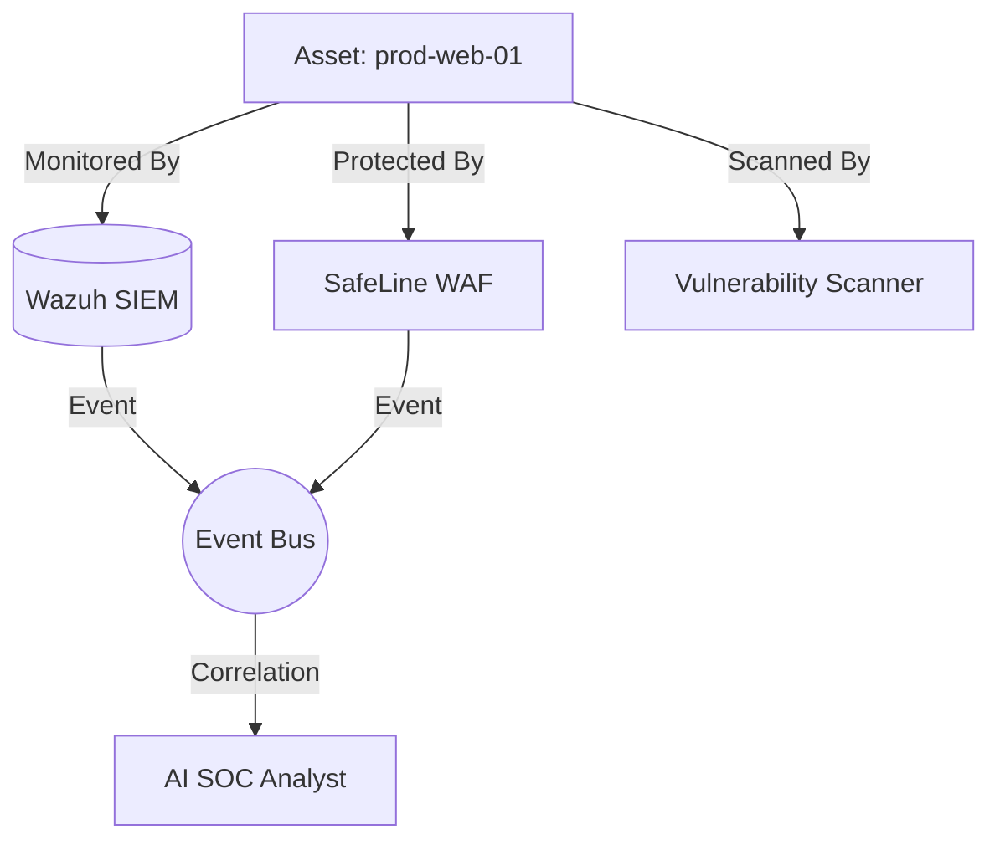

# Vyomrix Asset Intelligence Platform

The Asset Intelligence Platform is the contextual backbone of Vyomrix. Security telemetry is meaningless without understanding *what* is being attacked. 

By modeling every server, workstation, container, and honeypot as an `Asset`, Vyomrix can correlate logs across different domains.

## 1. Architecture

## 2. Asset Schema

An asset contains critical metadata required for incident triage:
- `id`: Unique Vyomrix identifier.
- `hostname` / `ip_address`: Core identifiers.
- `asset_type`: Server, Workstation, Honeypot, etc.
- `criticality`: Low, Medium, High, Critical.
- `environment`: Production, Staging, Dev.
- `tags`: e.g., `pci-dss`, `database`.

## 3. The Power of Correlation

When an attacker attempts an exploit:
1. The **Threat Intelligence** engine flags the IP as malicious.
2. The **WAF** blocks a SQL Injection from that IP.
3. The **SIEM** detects a suspicious process execution on an endpoint from that same IP.

Because all these events reference the **Asset ID**, the **AI Analyst** can immediately inform the SOC:
> "A known malicious IP attempted a SQL Injection against a **Critical Production** web server. The WAF blocked it, but the same IP later successfully logged into an unpatched internal asset."
