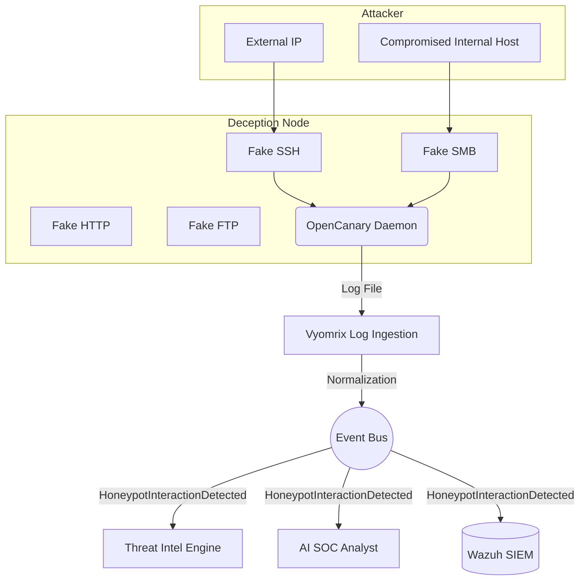

# Vyomrix Enterprise Deception Platform

The Deception Platform utilizes **OpenCanary** to generate high-fidelity alerts. Because honeypots have no legitimate business purpose, *any* interaction is treated as malicious.

## 1. Architecture



## 2. Infrastructure

The honeypot runs as a standalone Docker Compose stack (`infrastructure/docker/02-Honeypot`).
It uses `network_mode: "host"` to bind directly to standard ports (21, 80, 445, 2222).
Configuration is managed modularly in `opencanary.conf`.

### Deployed Services
- **FTP (Port 21):** Simulates an anonymous FTP drop.
- **HTTP (Port 80):** Simulates a NAS login portal.
- **SMB (Port 445):** Simulates an open Windows File Share.
- **SSH (Port 2222):** Simulates a Linux SSH server.

## 3. Event Flow & Normalization

Raw JSON logs from `/var/tmp/opencanary.log` are ingested by the `DeceptionManager` (`backend/app/domains/deception/services.py`).

1. **Mapping**: OpenCanary's integer logtypes (e.g., `4000`) are mapped to `HoneypotService.SSH`.
2. **Normalization**: The raw log is flattened into a standardized `DeceptionEvent`.
3. **Event Bus**: The event is published to the central Vyomrix Event Bus as a `HONEYPOT_INTERACTION_DETECTED` event.

### Example Normalized Payload
```json
{
  "id": "abc-123",
  "timestamp": "2026-07-21T18:00:00Z",
  "service": "ssh",
  "src_ip": "185.15.22.1",
  "src_port": 54321,
  "dst_ip": "10.0.0.50",
  "dst_port": 2222,
  "log_type": "Login Attempt (root:password)",
  "payload": {},
  "is_enriched": false,
  "threat_score": null,
  "threat_tags": []
}
```

## 4. Platform Integration

Because of the Event Bus architecture, adding the honeypot requires **zero** changes to the SIEM or Threat Intel engine. They simply subscribe to the deception event and react automatically.

- **SIEM:** Automatically indexes the event for long-term storage and correlation.
- **Threat Intel:** Extracts the `src_ip` and looks it up in VirusTotal/AbuseIPDB.
- **AI Analyst:** Takes the enriched event and generates a triage summary for the dashboard.
