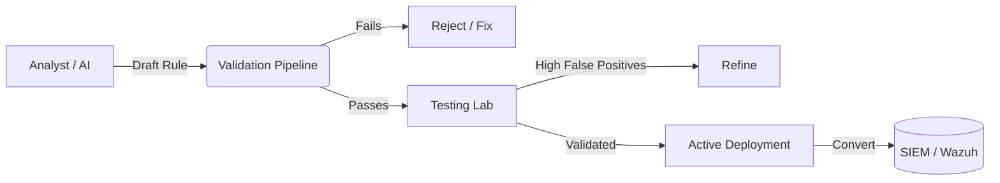

# Vyomrix Detection Engineering Platform

The Detection Engineering Platform manages the lifecycle of custom detection logic (primarily Sigma rules) across the enterprise. It ensures that bad, malformed, or overly noisy rules never reach production.

## 1. Sigma Rule Lifecycle

## 2. Rule Validation Pipeline

When a rule is submitted to the API (`POST /api/v1/detection/rules`), it must pass a strict validation pipeline (`backend/app/domains/detection/services.py`):
1. **Valid YAML:** Is the string correctly formatted?
2. **Schema Compliance:** Does it contain `id`, `title`, `logsource`, and `detection` blocks?
3. **Condition Logic:** Does the `detection` block have a valid `condition`?

## 3. The AI Detection Engineer

Vyomrix extends the AI Platform with a specialized Detection Engineer prompt. 
Instead of an analyst writing complex YAML by hand, they can describe an attack:
> "Write a Sigma rule to detect PowerShell running with an encoded command bypassing the execution policy."

The AI will:
1. Generate the valid Sigma YAML.
2. Automatically map it to MITRE ATT&CK (e.g., T1059.001).
3. Push it directly to the Validation Pipeline.
