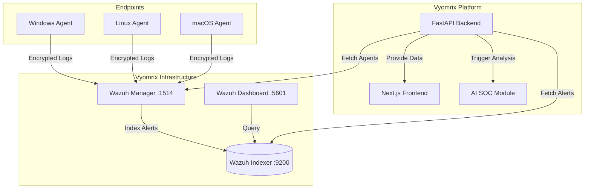

# Vyomrix SIEM (Wazuh Integration)

This document outlines the architecture, deployment, data flow, and APIs of the Vyomrix SIEM module, which is built on top of the Wazuh platform.

## 1. Architecture Diagram



## 2. Data Flow Diagram

1. **Ingestion**: Agents running on endpoints collect logs, FIM (File Integrity Monitoring), and syscheck data and send them to the **Wazuh Manager** over port `1514`.
2. **Decoding & Routing**: Wazuh Manager decodes the logs, applies detection rules (including MITRE ATT&CK mapping), and generates security alerts.
3. **Storage**: Alerts are forwarded and stored in the **Wazuh Indexer** (OpenSearch) under the `wazuh-alerts-*` index pattern.
4. **Normalization**: The **Vyomrix FastAPI Backend** periodically (or dynamically) queries the Indexer. It normalizes the Wazuh specific JSON into the Vyomrix universal `NormalizedAlert` schema.
5. **Consumption**: The normalized alerts are served via REST APIs to the **Vyomrix Frontend** for human review, and to the **AI SOC Analyst** module for automated triage.

## 3. Deployment Guide

The SIEM is deployed as a Docker Compose stack.

### Prerequisites
- Docker & Docker Compose
- Minimum 4GB RAM (8GB+ recommended)
- `vm.max_map_count` must be set to `262144` on the host OS for OpenSearch.

### Start the SIEM Stack
1. Navigate to the infrastructure folder:
   ```bash
   cd infrastructure/docker/01-Wazuh-SIEM
   ```
2. Start the cluster:
   ```bash
   docker-compose up -d
   ```
3. The `wazuh.generator` container will automatically run to generate necessary SSL certificates for the Indexer and Manager. 
4. The dashboard will be available at `https://localhost:5601` (Default credentials: `admin` / `SecretPassword123!`).

## 4. API Documentation

The backend abstracts Wazuh through internal routes prefixed with `/api/v1/siem`.

### `GET /api/v1/siem/alerts`
Fetches the most recent security events, normalized into the Vyomrix alert model.

**Response Schema (`NormalizedAlert`)**:
```json
{
  "id": "string",
  "timestamp": "2026-07-21T12:00:00Z",
  "title": "Suspicious PowerShell Execution Detected",
  "severity": 12,
  "source": {
    "name": "Wazuh",
    "ip": "192.168.1.105",
    "agent_id": "001",
    "agent_name": "win-desktop-01"
  },
  "rule_id": "91802",
  "mitre": {
    "id": ["T1059.001"],
    "tactic": ["Execution"],
    "technique": ["PowerShell"]
  },
  "tags": ["windows", "sysmon"]
}
```

### `GET /api/v1/siem/agents`
Fetches the inventory of all monitored endpoints and their connection status.

## 5. Troubleshooting Guide

**Issue:** Wazuh Indexer container constantly restarting (Exit Code 78).
**Fix:** OpenSearch requires `vm.max_map_count` to be increased.
On Linux: `sysctl -w vm.max_map_count=262144`
On Windows (WSL2): Run `wsl -d docker-desktop` and execute `sysctl -w vm.max_map_count=262144`.

**Issue:** Vyomrix API returns empty lists for alerts.
**Fix:** Verify that the backend has the correct `INDEXER_PASSWORD`. If no alerts are generating, verify that a Wazuh agent is connected and actively producing logs.

**Issue:** Certificate errors in Wazuh logs.
**Fix:** Stop the cluster (`docker-compose down -v`), remove the `certs` volume, and restart the cluster to allow `wazuh.generator` to create fresh certificates.
