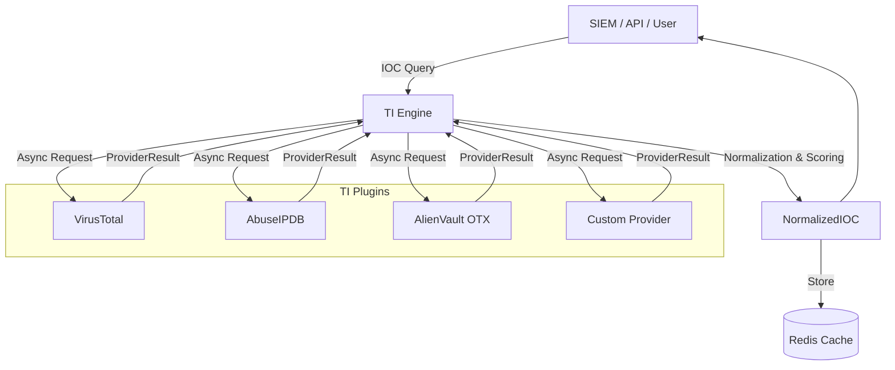

# Vyomrix Threat Intelligence Engine

The Threat Intelligence (TI) Engine is an extensible, asynchronous platform designed to enrich Indicators of Compromise (IOCs) across multiple provider plugins. It normalizes external data into a universal `NormalizedIOC` format and computes a unified risk score.

## 1. Architecture



## 2. Plugin Architecture

Vyomrix uses a plugin-based architecture for Threat Intelligence. This ensures that the core platform logic is completely decoupled from any single vendor's API.

To add a new TI provider:
1. Create a class inheriting from `ThreatIntelProvider` (in `backend/app/domains/threat_intel/providers/base.py`).
2. Implement the `name`, `supported_types`, and `lookup` methods.
3. Return a `ProviderResult` object containing the malicious status, confidence score, and associated tags.

### Base Interface
```python
class ThreatIntelProvider(ABC):
    @property
    @abstractmethod
    def name(self) -> str: pass
        
    @property
    @abstractmethod
    def supported_types(self) -> List[IOCType]: pass
        
    @abstractmethod
    async def lookup(self, ioc_value: str, ioc_type: IOCType) -> Optional[ProviderResult]: pass
```

## 3. Risk Scoring & Normalization

The TI engine queries all providers concurrently. Once all responses (or timeouts) are collected, it merges the data.

### Scoring Logic
1. **Tags**: All tags from all providers are deduplicated and merged.
2. **Confidence**: The baseline risk score is the average confidence score across all malicious hits, plus a penalty multiplier for every unique provider that flags the IOC as malicious.
3. **Levels**:
   - 0: `CLEAN`
   - 1-30: `LOW`
   - 31-60: `MEDIUM`
   - 61-80: `HIGH`
   - 81-100: `CRITICAL`

## 4. API Endpoints

### `GET /api/v1/threat-intel/lookup`
Lookup an IOC (IP, Domain, Hash, URL, or CVE).

**Parameters:**
- `ioc_value` (string, required): e.g., `8.8.8.8` or `185.15.22.1`
- `ioc_type` (string, required): `ip`, `domain`, `hash`, `url`, `cve`

**Response (`NormalizedIOC`):**
```json
{
  "ioc_value": "185.15.22.1",
  "ioc_type": "ip",
  "risk_level": "critical",
  "risk_score": 94,
  "tags": [
    "ssh-bruteforce",
    "vpn",
    "botnet",
    "malware"
  ],
  "providers": [
    {
      "provider_name": "VirusTotal",
      "is_malicious": true,
      "confidence": 85
    },
    {
      "provider_name": "AbuseIPDB",
      "is_malicious": true,
      "confidence": 99
    }
  ]
}
```

## 5. Security & Rate Limiting

- **API Keys**: All provider API keys must be securely stored in the `.env` file (e.g., `VT_API_KEY`, `ABUSEIPDB_API_KEY`).
- **Caching**: The TI Engine implements Redis caching to avoid exceeding free-tier limits on external APIs.
- **Failures**: Provider lookups utilize exponential backoff and fail gracefully, returning `None` instead of breaking the entire enrichment pipeline.
