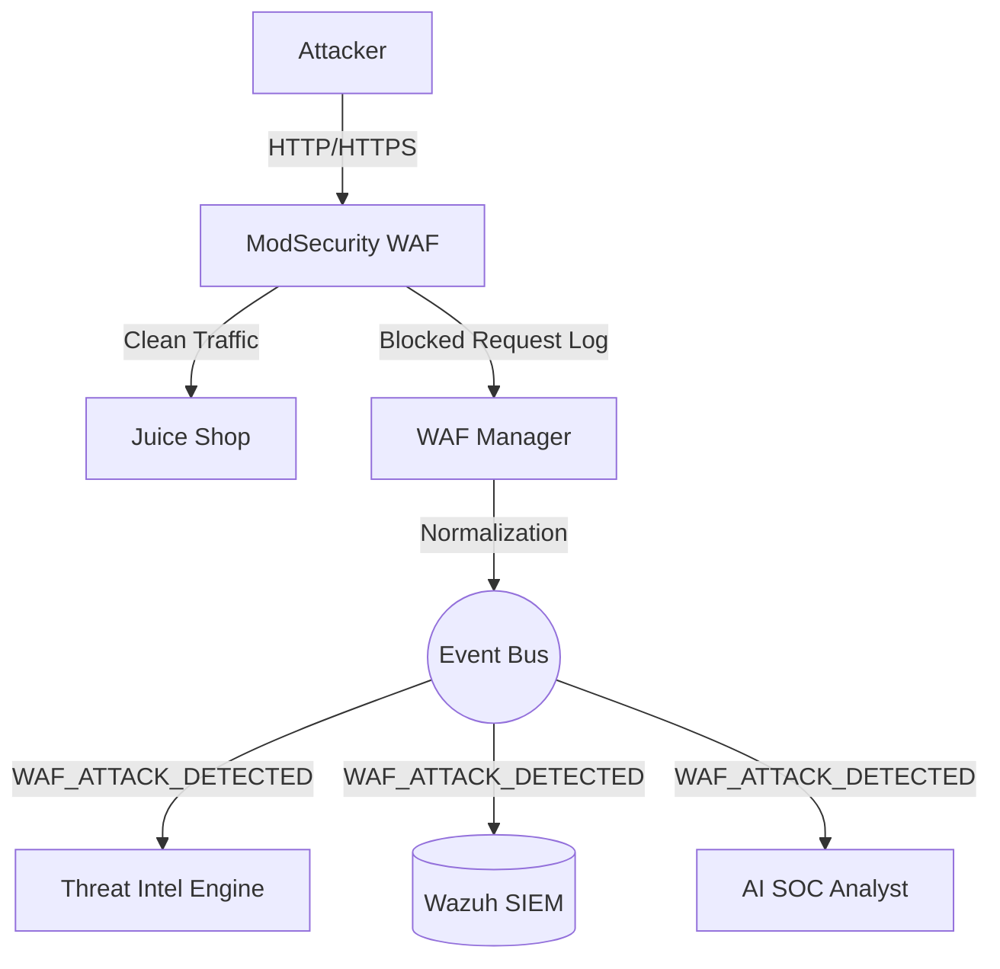

# Vyomrix Application Security Platform (WAF)

The Vyomrix Application Security Platform utilizes ModSecurity (with the OWASP Core Rule Set) to protect web assets. It proxies traffic to vulnerable demo applications (OWASP Juice Shop and DVWA) to generate realistic Layer 7 attack telemetry.

## 1. Architecture

## 2. Infrastructure Deployment

The WAF is deployed via Docker Compose in `infrastructure/docker/03-WAF`.
It operates as a reverse proxy on port `8080`, forwarding clean traffic to the protected `juiceshop` container.

**Blocking Mode**: ModSecurity is configured with `MODSEC_RULE_ENGINE=on` and `PARANOIA=1`. This immediately blocks common OWASP Top 10 attacks.

## 3. Event Normalization

Logs from `/var/log/nginx/error.log` (in JSON format) are parsed by the `WAFManager` (`backend/app/domains/waf/services.py`).

The manager maps ModSecurity rule messages to standardized Vyomrix `WAFEventType`s:
- `SQLInjectionDetected`
- `XSSDetected`
- `PathTraversalDetected`
- `CommandInjectionDetected`

The normalized event is then published to the Event Bus.

## 4. Cross-Domain Correlation

By publishing WAF events to the Event Bus, Vyomrix natively correlates attacks across multiple vectors.

**Example Scenario:**
1. An attacker enumerates the network and triggers the OpenCanary Honeypot.
2. The Honeypot publishes `HONEYPOT_INTERACTION_DETECTED`.
3. Five minutes later, the same IP attempts a SQL Injection against the WAF.
4. The WAF publishes `WAF_ATTACK_DETECTED`.
5. The AI Analyst subscribes to both, recognizes the matching `src_ip`, and elevates the risk score, generating a correlated Incident Case.

## 5. Attack Simulation Guide

To generate realistic alerts in Vyomrix, perform the following attacks against `http://localhost:8080`:

**1. SQL Injection (Login Bypass):**
Navigate to the Juice Shop login page and enter:
- **Email:** `' or 1=1--`
- **Password:** `anything`
*Expected:* WAF blocks the request (HTTP 403) and fires `SQLInjectionDetected`.

**2. Cross-Site Scripting (XSS):**
Navigate to the search bar and enter:
- ``
*Expected:* WAF blocks the request (HTTP 403) and fires `XSSDetected`.

**3. Path Traversal:**
Access the following URL:
- `http://localhost:8080/public/images/../../../../etc/passwd`
*Expected:* WAF blocks the request (HTTP 403) and fires `PathTraversalDetected`.
